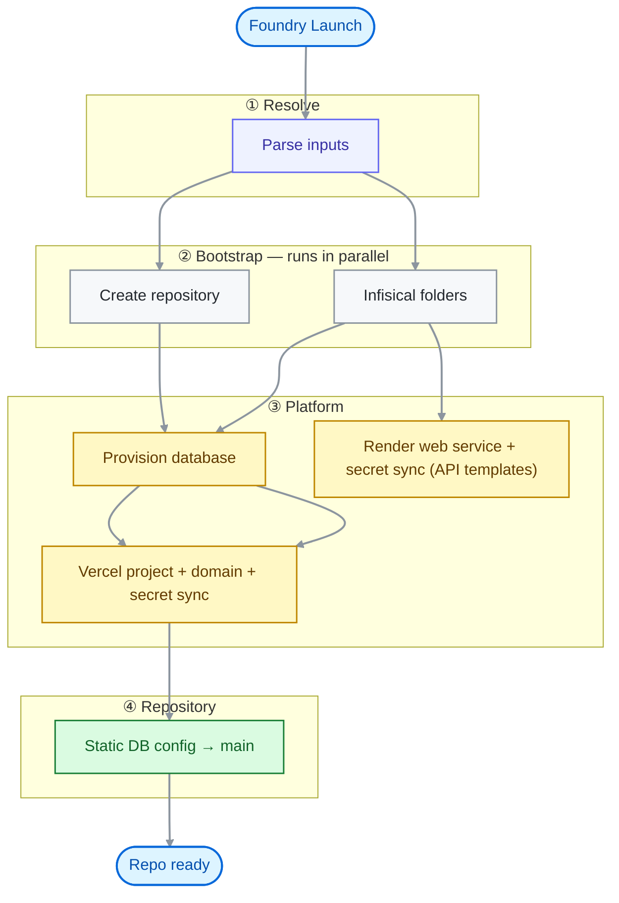

# Nexus Foundry

Nexus Foundry is a GitHub Actions–driven **project launch pipeline**. It takes a template repository and a short questionnaire (database, domain, team access, and so on), then provisions infrastructure, wires secrets, and applies static configuration—all in one workflow run.

This repository is the **orchestrator**. It does not contain application code; it contains the workflow, Node scripts, and shared libraries that operate on **newly generated** repos in your GitHub organization.

## What a launch does

When you run **Foundry Launch** (`.github/workflows/launch.yml`), jobs run in order:



| Stage             | Script             | Purpose                                                                        |
| ----------------- | ------------------ | ------------------------------------------------------------------------------ |
| **create_repo**   | `create_repo.js`   | Generate a new repo from a GitHub template; grant team access                  |
| **secrets_setup** | `secrets_setup.js` | Create Infisical folders per environment (`dev`/`staging`/`prod`): `/{projectName}` plus per-app subfolders (`/web`, and `/api` for API templates) |
| **db_setup**      | `db_setup.js`      | Provision database (Neon fully implemented; others stubbed)                    |
| **vercel_setup**  | `vercel_setup.js`  | Create Vercel project, optional custom domain, Infisical → Vercel secret syncs |
| **render_setup**  | `render_setup.js`  | API templates only: create a free Render web service (image from GHCR) in your Render Project, write `RENDER_SERVICE_ID`/`RENDER_API_KEY` repo secrets, store the service `API_URL` in `/{projectName}/api`, and Infisical → Render secret syncs from `/{projectName}/api` |
| **config**        | `config.js`        | Clone the new repo, apply static DB wiring (Neon), commit to `main`            |

Planned but commented out in the workflow: **redis_setup**, **s3_setup**.

## Triggering a launch

### Manual (`workflow_dispatch`)

In GitHub: **Actions → Foundry Launch → Run workflow**.

### Programmatic (`repository_dispatch`)

Send event type `foundry-launch` with a `client_payload` that mirrors the workflow inputs (for example from an internal queue or UI).

## Workflow inputs

| Input               | Required    | Description                                   |
| ------------------- | ----------- | --------------------------------------------- |
| `project_name`      | Yes         | New repository name (kebab-case)              |
| `team_access`       | Yes         | GitHub team slug to grant access              |
| `project_type`      | Yes         | Template repository name                      |
| `database`          | Yes         | `postgres` or `mongodb`                       |
| `postgres_provider` | If postgres | `neon` or `supabase`                          |
| `mongo_client`      | If mongodb  | `mongodb` or `mongoose`                       |
| `redis`             | No          | `true` or `false` (not wired yet)             |
| `s3`                | No          | `true` or `false` (not wired yet)             |
| `domain`            | Yes         | Production hostname for Vercel                |

Database inputs are validated in `.github/lib/scenario.js`, which maps them to a single **scenario** key: `neon`, `supabase`, `mongodb`, or `mongoose`.

## Required GitHub secrets

Configure these on the Foundry repo (and use the `nexus-queue` environment for the `setup` job):

| Secret                                                      | Used by                                           |
| ----------------------------------------------------------- | ------------------------------------------------- |
| `FOUNDRY_GITHUB_TOKEN`                                      | Create repo, clone/push generated repos            |
| `INFISICAL_ID` / `INFISICAL_TOKEN` / `INFISICAL_PROJECT_ID` | Infisical machine identity (workflow `env`)       |
| `INFISICAL_VERCEL_CONNECTION_ID`                            | Infisical → Vercel secret syncs                   |
| `VERCEL_TOKEN` / `VERCEL_TEAM_ID`                           | Vercel project + domain                           |
| `NEON_API_KEY`                                              | Neon provisioning (`NEON_ORG_ID` optional)        |
| `RENDER_API_KEY`                                            | Render API; also copied to API repos for deploys  |
| `RENDER_OWNER_ID`                                           | Render workspace/owner id (`tea-…` / `usr-…`)     |
| `RENDER_PROJECT_ID`                                         | Existing Render Project (`prj-…`); services nest in its environment |
| `GHCR_PULL_USERNAME` / `GHCR_PULL_TOKEN`                    | GitHub user + PAT (`read:packages`) for Render's GHCR registry credential |
| `INFISICAL_RENDER_CONNECTION_ID`                            | Infisical → Render secret syncs                   |

The workflow also expects Infisical credentials as `INFISICAL_CLIENT_ID` and `INFISICAL_CLIENT_SECRET` (mapped from `INFISICAL_ID` and `INFISICAL_TOKEN`).

## Extending Foundry

1. **New template** — Add an entry to `.github/lib/templates.js` and ensure a matching GitHub template repo exists.
2. **New database scenario** — Implement methods on `DatabaseSetup` (`db_setup.js`), `ConfigSetup` (`config.js`), and extend `deriveScenario` / `SCENARIO_KEYS` in `scenario.js`.
3. **New integrations** — Add clients under `.github/scripts/integrations/` and a job step in `launch.yml`.

## Local development

Scripts expect env vars documented in each file’s `assertRequiredEnv` / `prepare()` helpers. For git operations you need `GH_TOKEN` (or `FOUNDRY_GITHUB_TOKEN`) with rights on the target org.

Example (dry run of scenario derivation):

```bash
node -e "const { deriveScenario } = require('./.github/lib/scenario'); \
  console.log(deriveScenario({ database: 'postgres', postgresProvider: 'neon' }));"
```

The config job needs **pnpm** and **Node 24** when run outside Actions.

## Implementation status

- **Done:** repo creation, Infisical folders, Neon + Infisical `DATABASE_URL`, Vercel project + domain + secret syncs, Render web service for API templates + secret syncs, Neon static config
- **Stub / planned:** Supabase, MongoDB/Mongoose, Redis, S3

---

Maintained as infrastructure for DSC.
